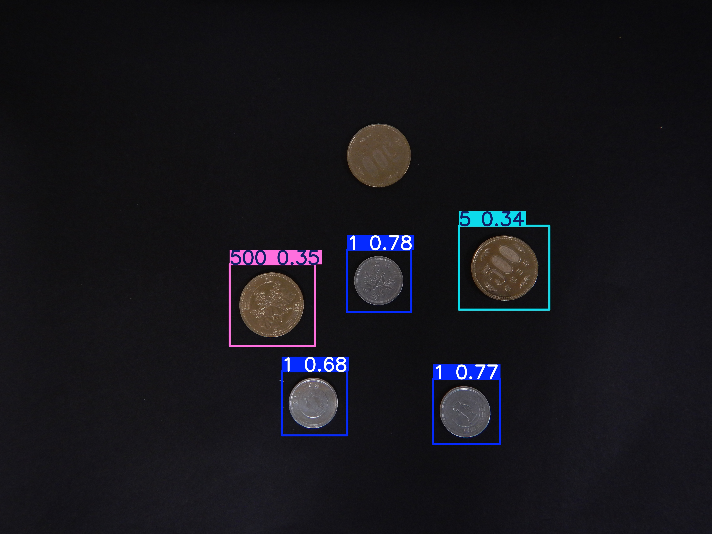
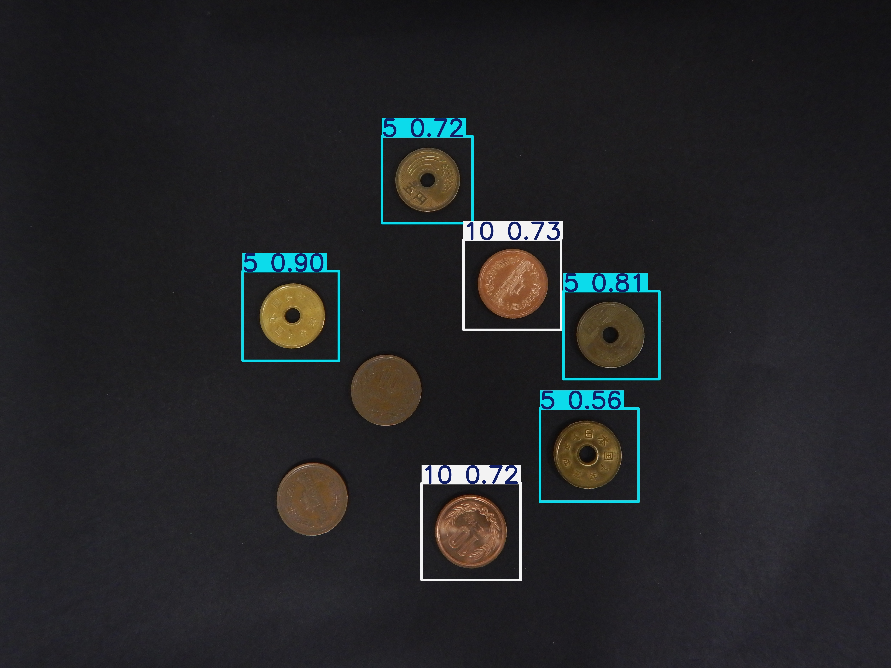
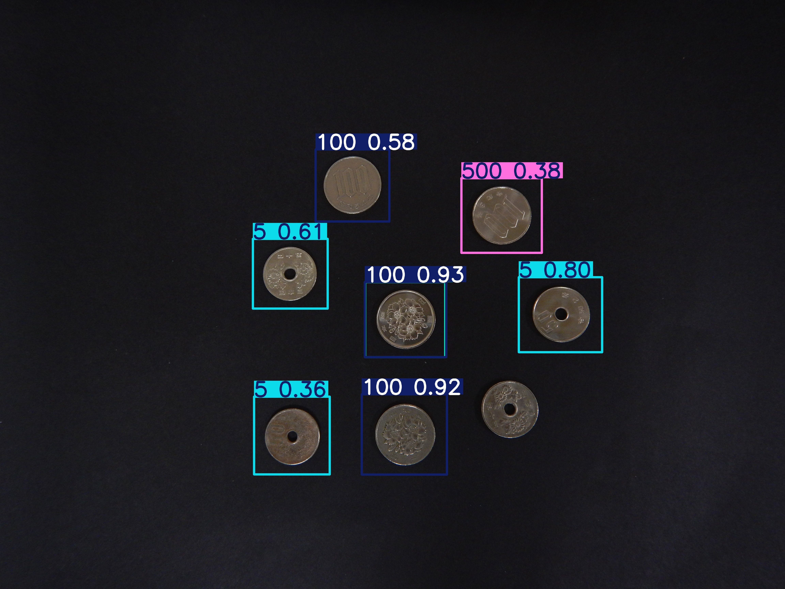
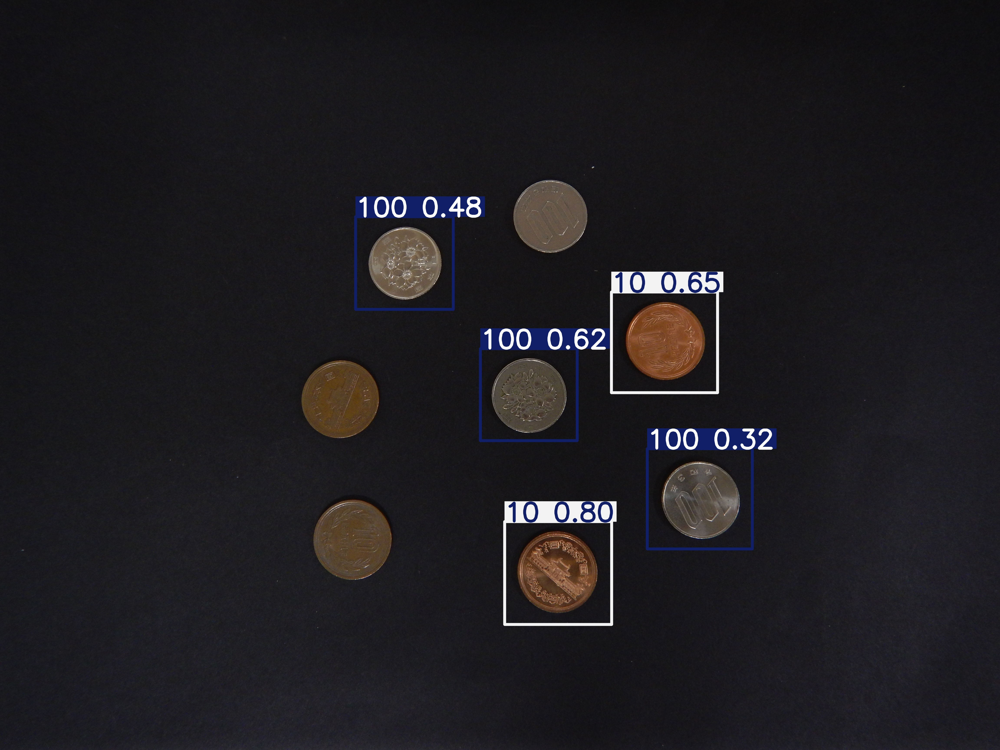
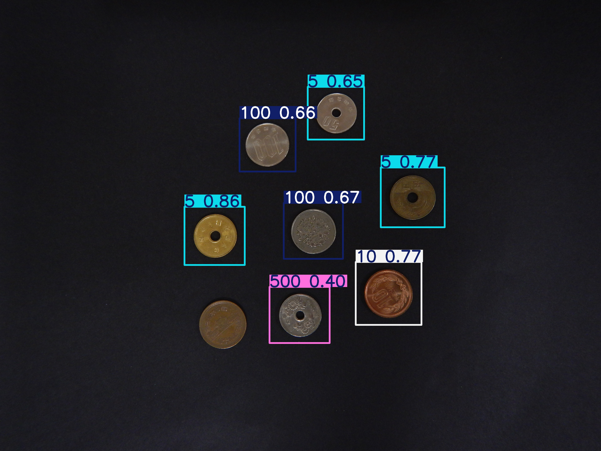
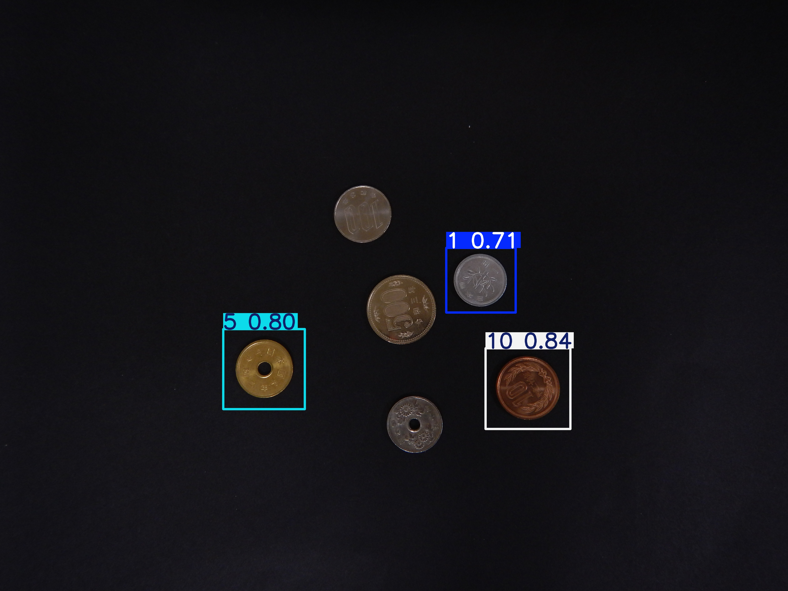
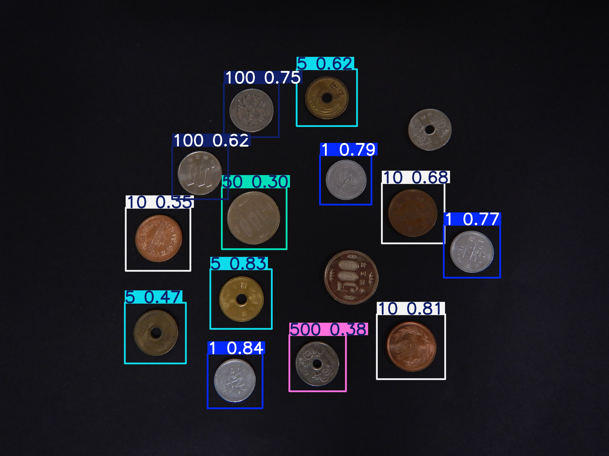
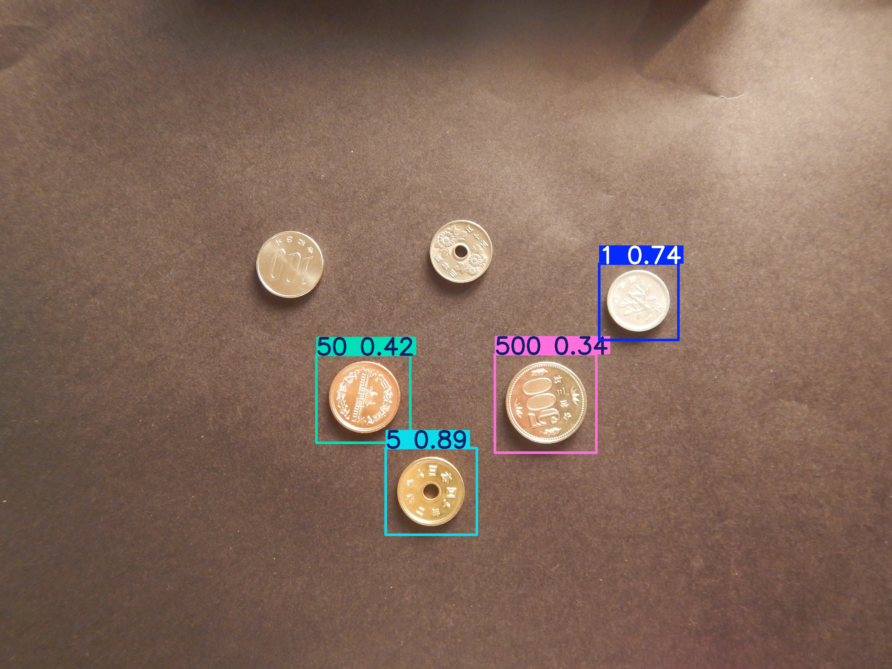
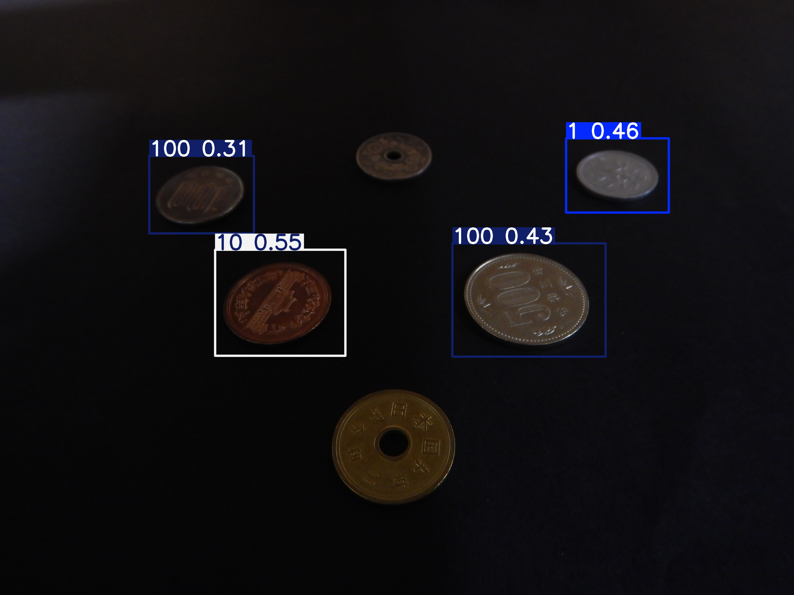
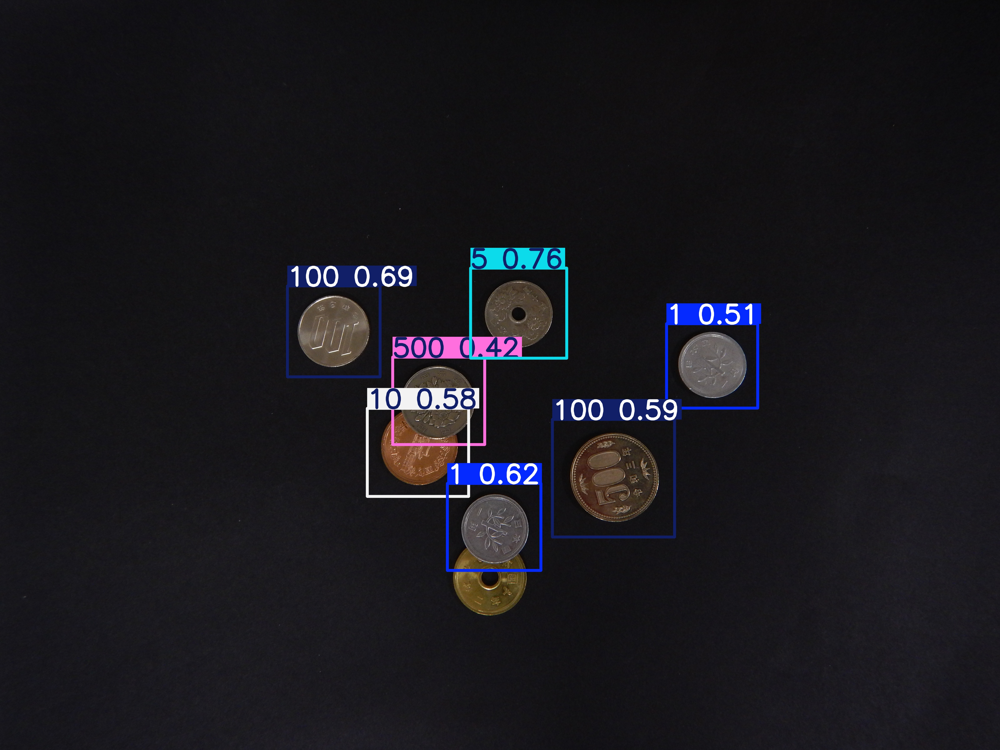

# CoinClassifier — YOLOv8 硬貨認識プロジェクト

**YOLOv8** を用いて日本国硬貨（1円、5円、10円、50円、100円、500円）を認識するプロジェクトです。
**画像分類 (Classification)** と **物体検出 (Object Detection)** の両方に対応しています。

---

## 📂 プロジェクト構成

```
coinyolo/
├── classification/              # 画像分類
│   ├── train.py                 #   学習スクリプト
│   ├── infer.py                 #   推論スクリプト
│   ├── detect_coins.py          #   応用: 複数硬貨の合計金額計算
│   └── data/                    #   データセット (train/val)
│
├── detection/                   # 物体検出
│   ├── train.py                 #   学習スクリプト
│   ├── annotate.py              #   アノテーションGUIツール
│   └── data/                    #   データセット
│       ├── raw/                 #     元画像
│       ├── annotations/         #     YOLOラベル (.txt)
│       └── dataset/             #     学習用 (自動生成)
│
├── images/                      # 共有画像
│   ├── test/                    #   テスト用画像 (kadai_01〜10)
│   └── results/                 #   推論結果出力先
│       ├── classification/
│       └── detection/
│
├── models/                      # ベースモデル (.pt)
├── runs/                        # 学習結果 (自動生成)
├── scripts/                     # 過去のスクリプト集
└── README.md
```

> **全スクリプトはプロジェクトルートから実行してください。**

---

## 🚀 使い方

### 環境構築
```bash
uv sync
```

### 画像分類 (Classification)

1枚の画像に写った硬貨の種類を判定します。

```bash
# 学習
uv run python classification/train.py

# 推論テスト
uv run python classification/infer.py

# 応用: 複数硬貨の合計金額計算
uv run python classification/detect_coins.py
```

### 物体検出 (Object Detection)

1枚の画像内の複数硬貨の位置と種類を同時に検出します。

```bash
# アノテーション (BBox付与ツール)
uv run python detection/annotate.py

# 学習
uv run python detection/train.py
```

---

## 🔰 YOLO初心者向けの基礎知識

| 方式 | モデル | 用途 | 学習データの準備 |
|---|---|---|---|
| **Classification** | `yolov8n-cls.pt` | 画像1枚 → 種類を1つ判定 | フォルダ分けするだけ（簡単） |
| **Detection** | `yolov8n.pt` | 画像1枚 → 複数物体の位置と種類を検出 | BBoxアノテーションが必要 |

---

## 物体検出結果













## 🛠️ トラブルシューティング

- **Q. Macで学習が遅い / 警告が出る**
  - Apple Silicon (M1/M2/M3/M4) をお使いの場合は `device='mps'` を指定してGPU高速化が可能です（設定済み）。
- **Q. detect_coins.py で硬貨を取りこぼす**
  - `cv2.HoughCircles` のパラメータ（`param1`, `param2`, `minRadius` など）を調整してください。

